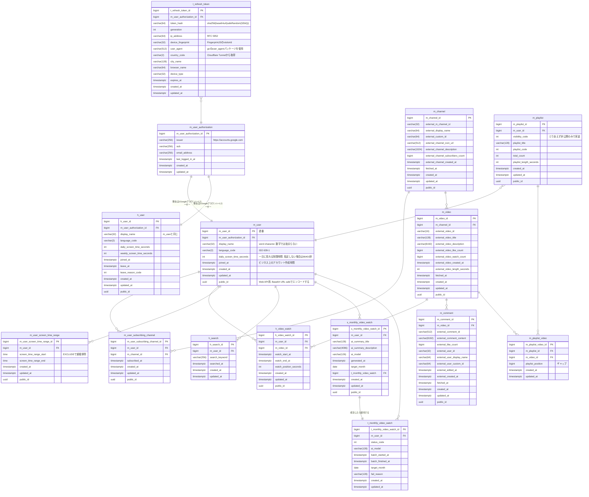

# ER図

## 論理設計

```mermaid
erDiagram
  m_user {
    bigint m_user_id PK "連番"
	  bigint m_user_authorization_id FK
    
    varchar(32) display_name "word charactor. 数字では始まらない"
    varchar(2) language_code "ISO 639-1"
    
    int daily_screen_time_seconds "一日に見れる制限時間. 指定しない場合は86401秒"
    
    timestamptz joined_at "ビジネス上のアカウント作成時間"
    
    timestamptz created_at
    timestamptz updated_at
    
    uuid public_id "Web API用. Base64 URL safeでエンコードする"
  }
  
  m_user_authorization {
	  bigint m_user_authorization_id PK
	  
	  varchar(256) issuer "https://accounts.google.com"
	  varchar(256) sub
	  varchar(256) email_address
	  
	  timestamptz last_logged_in_at
	  
	  timestamptz created_at
	  timestamptz updated_at
  }
  
  t_refresh_token {
	  bigint t_refresh_token_id PK
	  bigint m_user_authorization_id FK
	  
	  varchar(64) token_hash "sha256(base64url(safeRandom(32bit)))"
	  int generation
	  varchar(64) ip_address "RFC 5952"
	  varchar(32) device_fingerprint "FingerprintJSのvisitorId"
	  varchar(512) user_agent "goのuser_agentパッケージを使用"
	  varchar(2) country_code "Cloudflare Tunnelから取得"
	  varchar(128) city_name
	  varchar(64) browser_name
	  varchar(32) device_type
	  
	  timestamptz expires_at
	  
	  timestamptz created_at
	  timestamptz updated_at
  }

  h_user {
    bigint h_user_id PK
	  bigint m_user_authorization_id FK
    
    varchar(32) display_name "m_userと同じ"
    varchar(2) language_code
    
    int daily_screen_time_seconds
    int weekly_screen_time_seconds
    
    timestamptz joined_at
    
    timestamptz leave_at
    int leave_reason_code
    
    timestamptz created_at
	  timestamptz updated_at
    
    uuid public_id
  }
  
  m_user_screen_time_range {
	  bigint m_user_screen_time_range_id PK
	  bigint m_user_id FK
	  
	  time screen_time_range_start "EXCLUDEで重複排除"
	  time screen_time_range_end

		timestamptz created_at
		timestamptz updated_at
		
		uuid public_id
  }
  
  m_user_subscribing_channel {
	  bigint m_user_subscribing_channel_id PK
	  bigint m_user_id FK
	  bigint m_channel_id FK
	  
	  timestamptz subscribed_at
	  
	  timestamptz created_at
	  timestamptz updated_at
	  
	  uuid public_id
  }
  
  m_channel {
	  bigint m_channel_id PK
	  
	  varchar(32) external_m_channel_id
	  varchar(64) external_display_name
	  varchar(64) external_custom_id
	  varchar(512) external_channel_icon_url
	  varchar(1024) external_channel_description
	  bigint external_channel_subscribers_count
	  timestamptz external_channel_created_at
	  
	  timestamptz fetched_at
	  
	  timestamptz created_at
	  timestamptz updated_at
	  
	  uuid public_id
  }
  
  m_video {
	  bigint m_video_id PK
	  
	  bigint m_channel_id FK
	  
	  varchar(16) external_video_id
	  varchar(128) external_video_title
	  varchar(8192) external_video_description
	  bigint external_video_like_count
	  bigint external_video_watch_count
	  timestamptz external_video_created_at
	  int external_video_length_seconds
	  
	  timestamptz fetched_at
	  
	  timestamptz created_at
	  timestamptz updated_at
	  
	  uuid public_id
  }
  
  m_comment {
	  bigint m_comment_id PK
	  
	  bigint m_video_id FK
	  
	  varchar(512) external_comment_id
	  varchar(8192) external_comment_content
	  bigint external_like_count
	  varchar(32) external_user_id
	  varchar(64) external_user_display_name
	  varchar(64) external_user_custom_id
	  timestamptz external_edited_at
	  timestamptz external_created_at
	  
	  timestamptz fetched_at
	  
	  timestamptz created_at
	  timestamptz updated_at
	  
	  uuid public_id
  }
  
  h_video_watch {
	  bigint h_video_watch_id PK
	  
	  bigint m_user_id FK
	  bigint m_video_id FK
	  
	  timestamptz watch_start_at
	  timestamptz watch_end_at
	  int watch_position_seconds
	  
	  timestamptz created_at
	  timestamptz updated_at
	  
	  uuid public_id
  }
  
  h_search {
	  bigint h_search_id PK
	  
	  bigint m_user_id FK
	  varchar(256) search_keyword
	  timestamptz searched_at
	  
	  timestamptz created_at
	  timestamptz updated_at
  }
  
  s_monthly_video_watch {
	  bigint s_monthly_video_watch_id PK
	  
	  bigint m_user_id FK
	  varchar(128) ai_summary_title
	  varchar(4096) ai_summary_description
	  varchar(126) ai_model
	  timestamptz generated_at
	  date target_month
	  
	  bigint t_monthly_video_watch FK
	  
	  timestamptz created_at
	  timestamptz updated_at
	  
	  uuid public_id
  }
  
  t_monthly_video_watch {
	  bigint t_monthly_video_watch_id PK
	  
	  bigint m_user_id FK
	  int status_code
	  varchar(128) ai_model
	  timestamptz batch_started_at
	  timestamptz batch_finished_at
	  date target_month
	  varchar(128) fail_reason
	  
	  timestamptz created_at
	  timestamptz updated_at
  }
  
  m_playlist {
	  bigint m_playlist_id PK
	  
	  bigint m_user_id FK
	  int visibility_code "とりあえず非公開のみで実装"
	  varchar(128) playlist_title
	  int playlist_code
	  
	  int total_count
	  int playlist_length_seconds
	  
	  timestamptz created_at
	  timestamptz updated_at
	  
	  uuid public_id
  }
  
  m_playlist_video {
	  bigint m_playlist_video_id PK
	  
	  bigint m_playlist_id FK
	  bigint m_video_id FK
	  
	  bigint playlist_position "ギャップ"
	  
	  timestamptz created_at
	  timestamptz updated_at
  }
  
  m_channel ||--o{ m_user_subscribing_channel: ""
  m_user ||--o{ m_user_subscribing_channel: ""
  m_video ||--o{ h_video_watch: ""
  m_user ||--o{ h_video_watch: ""
  m_video ||--o{ m_comment: ""
  m_user ||--o{ m_user_screen_time_range: ""
  m_channel ||--o{ m_video: ""
  m_user ||--o{ h_search: ""
  m_user ||--o{ s_monthly_video_watch: ""
  s_monthly_video_watch ||--|| t_monthly_video_watch: "成功したら紐付ける"
  m_user_authorization ||--|| m_user: "現在は1Googleアカウント=1ユーザー"
  m_user_authorization ||--|| h_user: "現在は1Googleアカウント=1ユーザー"
  t_refresh_token }o--|| m_user_authorization: ""
  t_monthly_video_watch }o--|| m_user: ""
  m_playlist }o--|| m_user: ""
  m_video ||--o{ m_playlist_video: ""
  m_playlist ||--o{ m_playlist_video: ""
```

## インデックス

```mermaid
erDiagram

    T_REFRESH_TOKEN {
        idx_1_t_refresh_token expires_at
        uk_1_t_refresh_token token_hash
    }

    M_USER_SUBSCRIBING_CHANNEL {
        idx_1_m_user_subscribing_channel m_user_id
        uk_1_m_user_subscribing_channel m_user_id_m_channel_id
    }

    M_USER_SCREEN_TIME_RANGE {
        idx_1_m_user_screen_time_range m_user_id
        idx_2_m_user_screen_time_range public_id
    }

    H_USER {
    }
    
    M_CHANNEL {
        idx_1_m_channel public_id
        uk_1_m_channel external_channel_id
        uk_2_m_channel external_custom_id
    }

    M_USER_AUTHORIZATION {
        idx_1_m_user_authorization sub
        uk_1_m_user_authorization issuer_sub
    }

    M_VIDEO {
        idx_1_m_video m_channel_id
        idx_2_m_video public_id
        uk_1_m_video external_video_id
    }

    M_COMMENT {
        idx_1_m_comment m_video_id
        idx_2_m_comment public_id
    }

    H_VIDEO_WATCH {
        idx_1_h_video_watch public_id
        idx_2_h_video_watch m_user_id
    }

    M_USER {
        idx_1_m_user public_id
    }

    H_SEARCH {
    }

    S_MONTHLY_VIDEO_WATCH {
        idx_1_s_monthly_video_watch public_id
        uk_1_s_monthly_video_watch m_user_id_target_month
    }

    T_MONTHLY_VIDEO_WATCH {
        uk_1_t_monthly_video_watch m_user_id_target_month
    }

    M_PLAYLIST {
        idx_1_m_playlist public_id
        idx_2_m_playlist m_user_id_playlist_code_created_at
    }
    
    M_PLAYLIST_VIDEO {
        uk_1_m_playlist_video m_playlist_id_m_video_id
    }
```