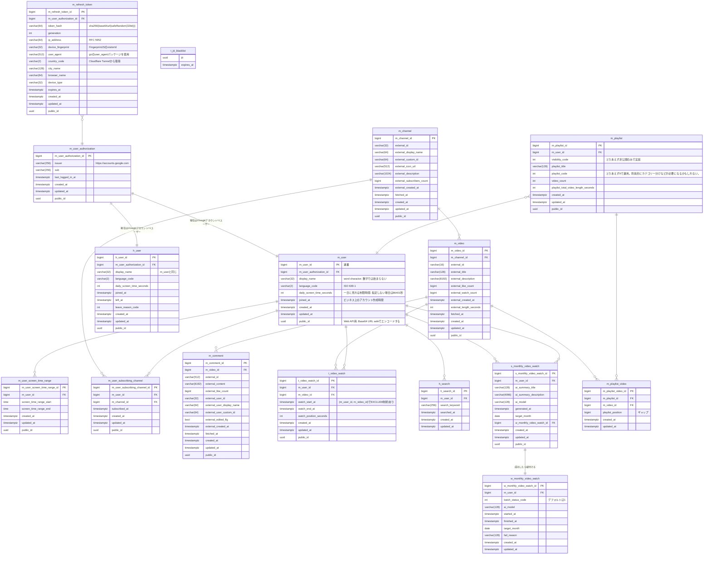

# ER図

## 論理設計

## インデックス

| テーブル名                      | インデックス名                          | カラム                                                       |
|----------------------------|----------------------------------|-----------------------------------------------------------|
| m_user                     | uk_1_m_user                      | public_id                                                 |
| m_user_authorization       | uk_1_m_user_authorization        | issuer, sub                                               |
| m_user_authorization       | uk_2_m_user_authorization        | public_id                                                 |
| m_refresh_token            | idx_1_m_refresh_token            | expires_at                                                |
| m_refresh_token            | uk_1_m_refresh_token             | token_hash                                                |
| m_refresh_token            | uk_2_m_refresh_token             | public_id                                                 |
| h_user                     | uk_1_h_user                      | public_id                                                 |
| m_user_screen_time_range   | idx_1_m_user_screen_time_range   | m_user_id                                                 |
| m_user_screen_time_range   | uk_1_m_user_screen_time_range    | public_id                                                 |
| m_user_subscribing_channel | idx_1_m_user_subscribing_channel | m_user_id                                                 |
| m_user_subscribing_channel | uk_1_m_user_subscribing_channel  | m_user_id, m_channel_id                                   |
| m_user_subscribing_channel | uk_2_m_user_subscribing_channel  | public_id                                                 |
| m_channel                  | uk_1_m_channel                   | public_id                                                 |
| m_channel                  | uk_2_m_channel                   | external_id                                               |
| m_channel                  | uk_3_m_channel                   | external_custom_id                                        |
| m_video                    | idx_1_m_video                    | m_channel_id                                              |
| m_video                    | uk_1_m_video                     | public_id                                                 |
| m_video                    | uk_2_m_video                     | external_id                                               |
| m_comment                  | idx_1_m_comment                  | m_video_id                                                |
| m_comment                  | uk_1_m_comment                   | public_id                                                 |
| m_comment                  | uk_2_m_comment                   | external_id                                               |
| t_video_watch              | uk_1_t_video_watch               | public_id                                                 |
| t_video_watch              | idx_1_t_video_watch              | m_user_id                                                 |
| h_search                   | idx_1_h_search                   | m_user_id                                                 |
| s_monthly_video_watch      | uk_1_s_monthly_video_watch       | public_id                                                 |
| s_monthly_video_watch      | uk_2_s_monthly_video_watch       | m_user_id, target_month                                   |
| m_playlist                 | uk_1_m_playlist                  | public_id                                                 |
| m_playlist                 | idx_1_m_playlist                 | m_user_id, playlist_visibility, playlist_code, created_at |
| m_playlist_video           | uk_1_m_playlist_video            | m_playlist_id, m_video_id                                 |
| t_jti_blacklist            | uk_1_t_jti_blacklist             | jti                                                       |
| t_jti_blacklist            | idx_1_t_jti_blacklist            | expires_at                                                |