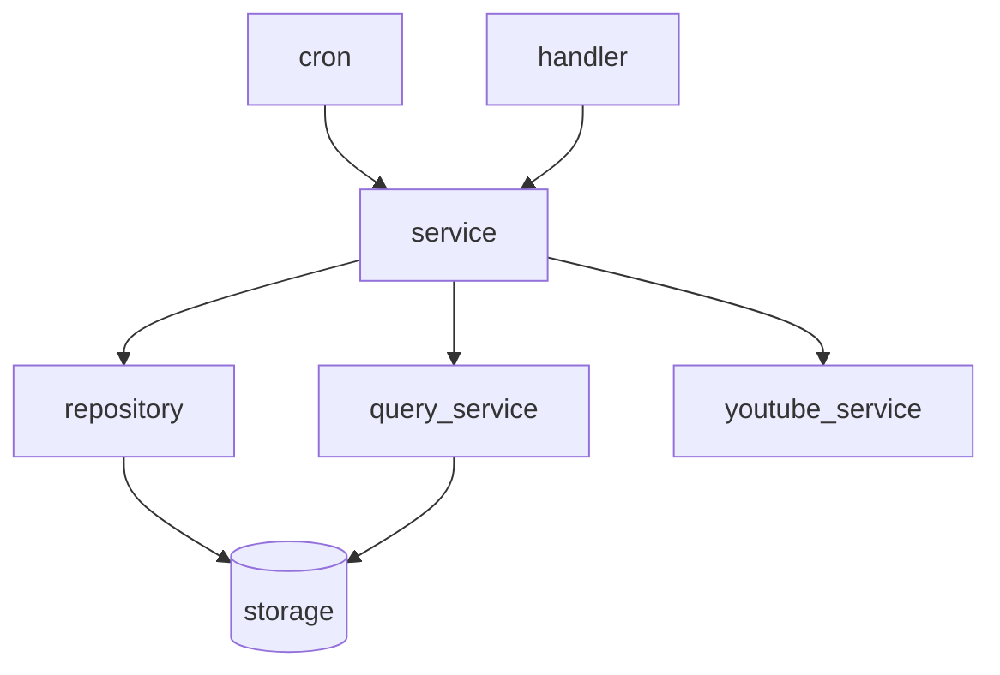
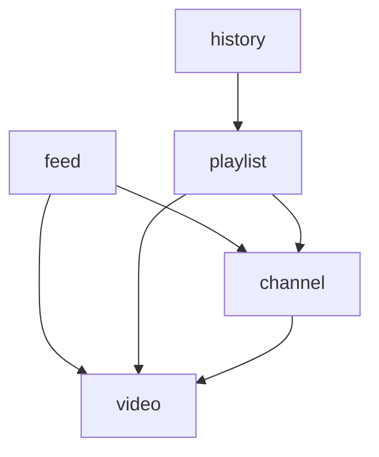

# backend

これは anti-yt のバックエンド設計に関するドキュメントです。

## 技術スタック

- Go
- go-chiによるHTTPルーティング
- oapi-codegenによるOpenAPIからのハンドラ型生成
- sqlcによるコード生成
- gooseによるマイグレーション
- pgtestdbによる実DBを用いたテスト

## アーキテクチャ

### 層の依存関係

### サービスの依存関係

## Domain

### Entity

- Entityはミュータブルな操作をする場合に使用してください
- デフォルト値を持つ場合はfunctional options patternを使用してください
    - ex: 指定がなければuuid v7を生成して使用するなど
- ポインタレシーバを使用してください

### Value Object

- Value Objectはイミュータブルな値を表すときに使用してください
- デフォルト値を持つ場合はfunctional options patternを使用してください
- youtube関連のオブジェクト(動画メタデータなど)は、操作するのはあくまでYouTube側のシステムで、anti-yt側からはイミュータブルなのでValue Objectを使用します
- 値レシーバを使用してください

## Repository

- 書き込み処理やロッキングリードを使う場合に使用します
- sqlcを通してPostgreSQLにクエリし、返ってきた値をエンティティにマッピングします
- 一貫性のため、使わないカラムもフェッチする場合があります
- 一個のクエリで済ませるよりも、単純なクエリを複数組み合わせます
    - 例えばプロフィールの差分更新などはcoalesceを使うのではなく、ロッキングリードでエンティティを構成するのに必要なカラムを取得し、それをエンティティのメソッドを通して更新し、それをupsertします
- 行が見つからない場合はcore.ErrNotFoundを返します

## QueryService

- 読み取りクエリに使用します
- 読み取りクエリなので、トランザクションは使わない設計になっています
- View構造体を定義し、それを返すことで無駄なカラムのフェッチを避けます
- パフォーマンスのため、複雑なクエリを使用することがあります
- 行が見つからない場合はcore.ErrNotFoundを返します

## Service

- トランザクションの抽象化は行いません。testをするときはpgtestdbを用いて実際のDBを叩きます
- ctxはロガーなどの横断的関心のみを載せます。userIDなどのユースケースのパラメータはメソッド引数として受け取ります
- トランザクション分離レベルはREPEATABLE READを使用し、書き込みの整合性はロッキングリードや勧告ロックを使用します

## Handler

- serviceを呼び出します
- handlerの型はoapi-codegenによって生成されるため、テストは実装しません
- errはレスポンスに変換せずそのまま返し、middlewareで変換を行います
- uuidはmiddlewareによってbase64 url-safeでエンコードされます

## DB設計

### ID

- 主キーはbigintの連番をもたせて、APIでIDを公開したい場合にはpublic_idカラムをつくり、そこにuuid v7を乗せるようにしています
- nano idやsnowflake idはライブラリの安定性や外部サービスの対応などを考えて使用していません
- 現在はpublic_idを廃止し、主キーをuuid v7で統一することを計画しています

### 外部キー

- 外部キーはON DELETE CASCADEを使用したいときのみに使用します
- RESTRICTは使用しません
    - アプリ側のエラーハンドリングがDB依存になり、エラー種別の判定が煩雑化するためです
    - SET NULLはNULL許容カラムを増やすため使用しません

### CHECK, EXCLUDE制約など

- CHECKやEXCLUDE制約はつけず、アプリケーション側で検証しています
- ドメインロジックの制約は変更される可能性があるので、柔軟なアプリ側で検証を行なっていますが、普遍的なものに関してはDB側でも制約をかけてもいいかもしれません
    - 現在は書き込みクエリは必ずRepositoryを使うようにして、エンティティや値オブジェクトのコンストラクタなどで検証しています

## エラー戦略

- coreでDomainErrorが定義され、これを主に使用します
- errはutil.Wrapでラップされ、最終的にはmiddlewareによってレスポンスに変換されます
    - DomainError以外のエラーはすべてinternal server errorとして変換されます

## 認証・認可

- OIDCを使用したソーシャルログインを採用しています
- ID Tokenを検証したのち、アプリ独自のJWTを発行してクライアントに返します
- JWTはmiddlewareで検証し、認証済みユーザーのIDをハンドラ以降に伝播します
- ユーザーの所有リソースに対する操作は、serviceのメソッド内でuserIDを検証します
- 権限判定をドメイン層に寄せ、handlerでは認可判定を行いません
- ログアウトや強制失効に対応するため、JTI(JWT ID)をブラックリストで管理します
- リクエスト時にmiddlewareがブラックリストを参照し、失効済みトークンを拒否します

## テスト戦略

- service, domain を重点的にテストします
- pgtestdbを使用して実際のPostgreSQLに対してテストを実行します
- YouTube APIやOIDCプロバイダなど外部依存はインターフェースで抽象化し、mockを注入します

## 定期実行

- cronベースのスケジューラで定期ジョブを実行します
- APIリクエストからjobが実行されるようにして、Cloud Schedulerなどで発火するようにしたいです
