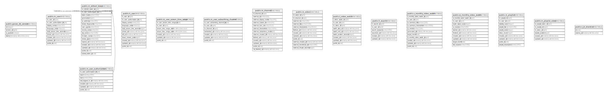

# example

## Tables

| Name | Columns | Comment | Type |
| ---- | ------- | ------- | ---- |
| [public.goose_db_version](public.goose_db_version.md) | 4 |  | BASE TABLE |
| [public.m_user](public.m_user.md) | 9 |  | BASE TABLE |
| [public.m_user_authorization](public.m_user_authorization.md) | 7 |  | BASE TABLE |
| [public.m_refresh_token](public.m_refresh_token.md) | 18 |  | BASE TABLE |
| [public.h_user](public.h_user.md) | 11 |  | BASE TABLE |
| [public.m_user_screen_time_range](public.m_user_screen_time_range.md) | 7 |  | BASE TABLE |
| [public.m_user_subscribing_channel](public.m_user_subscribing_channel.md) | 7 |  | BASE TABLE |
| [public.m_channel](public.m_channel.md) | 14 |  | BASE TABLE |
| [public.m_video](public.m_video.md) | 12 |  | BASE TABLE |
| [public.t_video_watch](public.t_video_watch.md) | 9 |  | BASE TABLE |
| [public.h_search](public.h_search.md) | 6 |  | BASE TABLE |
| [public.s_monthly_video_watch](public.s_monthly_video_watch.md) | 11 |  | BASE TABLE |
| [public.w_monthly_video_watch](public.w_monthly_video_watch.md) | 10 |  | BASE TABLE |
| [public.m_playlist](public.m_playlist.md) | 10 |  | BASE TABLE |
| [public.m_playlist_video](public.m_playlist_video.md) | 6 |  | BASE TABLE |
| [public.t_jti_blacklist](public.t_jti_blacklist.md) | 2 |  | BASE TABLE |

## Stored procedures and functions

| Name | ReturnType | Arguments | Type |
| ---- | ------- | ------- | ---- |
| public.gbtreekey4_in | gbtreekey4 | cstring | FUNCTION |
| public.gbtreekey4_out | cstring | gbtreekey4 | FUNCTION |
| public.gbtreekey8_in | gbtreekey8 | cstring | FUNCTION |
| public.gbtreekey8_out | cstring | gbtreekey8 | FUNCTION |
| public.gbtreekey16_in | gbtreekey16 | cstring | FUNCTION |
| public.gbtreekey16_out | cstring | gbtreekey16 | FUNCTION |
| public.gbtreekey32_in | gbtreekey32 | cstring | FUNCTION |
| public.gbtreekey32_out | cstring | gbtreekey32 | FUNCTION |
| public.gbtreekey_var_in | gbtreekey_var | cstring | FUNCTION |
| public.gbtreekey_var_out | cstring | gbtreekey_var | FUNCTION |
| public.cash_dist | money | money, money | FUNCTION |
| public.date_dist | int4 | date, date | FUNCTION |
| public.float4_dist | float4 | real, real | FUNCTION |
| public.float8_dist | float8 | double precision, double precision | FUNCTION |
| public.int2_dist | int2 | smallint, smallint | FUNCTION |
| public.int4_dist | int4 | integer, integer | FUNCTION |
| public.int8_dist | int8 | bigint, bigint | FUNCTION |
| public.interval_dist | interval | interval, interval | FUNCTION |
| public.oid_dist | oid | oid, oid | FUNCTION |
| public.time_dist | interval | time without time zone, time without time zone | FUNCTION |
| public.ts_dist | interval | timestamp without time zone, timestamp without time zone | FUNCTION |
| public.tstz_dist | interval | timestamp with time zone, timestamp with time zone | FUNCTION |
| public.gbt_oid_consistent | bool | internal, oid, smallint, oid, internal | FUNCTION |
| public.gbt_oid_distance | float8 | internal, oid, smallint, oid, internal | FUNCTION |
| public.gbt_oid_fetch | internal | internal | FUNCTION |
| public.gbt_oid_compress | internal | internal | FUNCTION |
| public.gbt_decompress | internal | internal | FUNCTION |
| public.gbt_var_decompress | internal | internal | FUNCTION |
| public.gbt_var_fetch | internal | internal | FUNCTION |
| public.gbt_oid_penalty | internal | internal, internal, internal | FUNCTION |
| public.gbt_oid_picksplit | internal | internal, internal | FUNCTION |
| public.gbt_oid_union | gbtreekey8 | internal, internal | FUNCTION |
| public.gbt_oid_same | internal | gbtreekey8, gbtreekey8, internal | FUNCTION |
| public.gbt_int2_consistent | bool | internal, smallint, smallint, oid, internal | FUNCTION |
| public.gbt_int2_distance | float8 | internal, smallint, smallint, oid, internal | FUNCTION |
| public.gbt_int2_compress | internal | internal | FUNCTION |
| public.gbt_int2_fetch | internal | internal | FUNCTION |
| public.gbt_int2_penalty | internal | internal, internal, internal | FUNCTION |
| public.gbt_int2_picksplit | internal | internal, internal | FUNCTION |
| public.gbt_int2_union | gbtreekey4 | internal, internal | FUNCTION |
| public.gbt_int2_same | internal | gbtreekey4, gbtreekey4, internal | FUNCTION |
| public.gbt_int4_consistent | bool | internal, integer, smallint, oid, internal | FUNCTION |
| public.gbt_int4_distance | float8 | internal, integer, smallint, oid, internal | FUNCTION |
| public.gbt_int4_compress | internal | internal | FUNCTION |
| public.gbt_int4_fetch | internal | internal | FUNCTION |
| public.gbt_int4_penalty | internal | internal, internal, internal | FUNCTION |
| public.gbt_int4_picksplit | internal | internal, internal | FUNCTION |
| public.gbt_int4_union | gbtreekey8 | internal, internal | FUNCTION |
| public.gbt_int4_same | internal | gbtreekey8, gbtreekey8, internal | FUNCTION |
| public.gbt_int8_consistent | bool | internal, bigint, smallint, oid, internal | FUNCTION |
| public.gbt_int8_distance | float8 | internal, bigint, smallint, oid, internal | FUNCTION |
| public.gbt_int8_compress | internal | internal | FUNCTION |
| public.gbt_int8_fetch | internal | internal | FUNCTION |
| public.gbt_int8_penalty | internal | internal, internal, internal | FUNCTION |
| public.gbt_int8_picksplit | internal | internal, internal | FUNCTION |
| public.gbt_int8_union | gbtreekey16 | internal, internal | FUNCTION |
| public.gbt_int8_same | internal | gbtreekey16, gbtreekey16, internal | FUNCTION |
| public.gbt_float4_consistent | bool | internal, real, smallint, oid, internal | FUNCTION |
| public.gbt_float4_distance | float8 | internal, real, smallint, oid, internal | FUNCTION |
| public.gbt_float4_compress | internal | internal | FUNCTION |
| public.gbt_float4_fetch | internal | internal | FUNCTION |
| public.gbt_float4_penalty | internal | internal, internal, internal | FUNCTION |
| public.gbt_float4_picksplit | internal | internal, internal | FUNCTION |
| public.gbt_float4_union | gbtreekey8 | internal, internal | FUNCTION |
| public.gbt_float4_same | internal | gbtreekey8, gbtreekey8, internal | FUNCTION |
| public.gbt_float8_consistent | bool | internal, double precision, smallint, oid, internal | FUNCTION |
| public.gbt_float8_distance | float8 | internal, double precision, smallint, oid, internal | FUNCTION |
| public.gbt_float8_compress | internal | internal | FUNCTION |
| public.gbt_float8_fetch | internal | internal | FUNCTION |
| public.gbt_float8_penalty | internal | internal, internal, internal | FUNCTION |
| public.gbt_float8_picksplit | internal | internal, internal | FUNCTION |
| public.gbt_float8_union | gbtreekey16 | internal, internal | FUNCTION |
| public.gbt_float8_same | internal | gbtreekey16, gbtreekey16, internal | FUNCTION |
| public.gbt_ts_consistent | bool | internal, timestamp without time zone, smallint, oid, internal | FUNCTION |
| public.gbt_ts_distance | float8 | internal, timestamp without time zone, smallint, oid, internal | FUNCTION |
| public.gbt_tstz_consistent | bool | internal, timestamp with time zone, smallint, oid, internal | FUNCTION |
| public.gbt_tstz_distance | float8 | internal, timestamp with time zone, smallint, oid, internal | FUNCTION |
| public.gbt_ts_compress | internal | internal | FUNCTION |
| public.gbt_tstz_compress | internal | internal | FUNCTION |
| public.gbt_ts_fetch | internal | internal | FUNCTION |
| public.gbt_ts_penalty | internal | internal, internal, internal | FUNCTION |
| public.gbt_ts_picksplit | internal | internal, internal | FUNCTION |
| public.gbt_ts_union | gbtreekey16 | internal, internal | FUNCTION |
| public.gbt_ts_same | internal | gbtreekey16, gbtreekey16, internal | FUNCTION |
| public.gbt_time_consistent | bool | internal, time without time zone, smallint, oid, internal | FUNCTION |
| public.gbt_time_distance | float8 | internal, time without time zone, smallint, oid, internal | FUNCTION |
| public.gbt_timetz_consistent | bool | internal, time with time zone, smallint, oid, internal | FUNCTION |
| public.gbt_time_compress | internal | internal | FUNCTION |
| public.gbt_timetz_compress | internal | internal | FUNCTION |
| public.gbt_time_fetch | internal | internal | FUNCTION |
| public.gbt_time_penalty | internal | internal, internal, internal | FUNCTION |
| public.gbt_time_picksplit | internal | internal, internal | FUNCTION |
| public.gbt_time_union | gbtreekey16 | internal, internal | FUNCTION |
| public.gbt_time_same | internal | gbtreekey16, gbtreekey16, internal | FUNCTION |
| public.gbt_date_consistent | bool | internal, date, smallint, oid, internal | FUNCTION |
| public.gbt_date_distance | float8 | internal, date, smallint, oid, internal | FUNCTION |
| public.gbt_date_compress | internal | internal | FUNCTION |
| public.gbt_date_fetch | internal | internal | FUNCTION |
| public.gbt_date_penalty | internal | internal, internal, internal | FUNCTION |
| public.gbt_date_picksplit | internal | internal, internal | FUNCTION |
| public.gbt_date_union | gbtreekey8 | internal, internal | FUNCTION |
| public.gbt_date_same | internal | gbtreekey8, gbtreekey8, internal | FUNCTION |
| public.gbt_intv_consistent | bool | internal, interval, smallint, oid, internal | FUNCTION |
| public.gbt_intv_distance | float8 | internal, interval, smallint, oid, internal | FUNCTION |
| public.gbt_intv_compress | internal | internal | FUNCTION |
| public.gbt_intv_decompress | internal | internal | FUNCTION |
| public.gbt_intv_fetch | internal | internal | FUNCTION |
| public.gbt_intv_penalty | internal | internal, internal, internal | FUNCTION |
| public.gbt_intv_picksplit | internal | internal, internal | FUNCTION |
| public.gbt_intv_union | gbtreekey32 | internal, internal | FUNCTION |
| public.gbt_intv_same | internal | gbtreekey32, gbtreekey32, internal | FUNCTION |
| public.gbt_cash_consistent | bool | internal, money, smallint, oid, internal | FUNCTION |
| public.gbt_cash_distance | float8 | internal, money, smallint, oid, internal | FUNCTION |
| public.gbt_cash_compress | internal | internal | FUNCTION |
| public.gbt_cash_fetch | internal | internal | FUNCTION |
| public.gbt_cash_penalty | internal | internal, internal, internal | FUNCTION |
| public.gbt_cash_picksplit | internal | internal, internal | FUNCTION |
| public.gbt_cash_union | gbtreekey16 | internal, internal | FUNCTION |
| public.gbt_cash_same | internal | gbtreekey16, gbtreekey16, internal | FUNCTION |
| public.gbt_macad_consistent | bool | internal, macaddr, smallint, oid, internal | FUNCTION |
| public.gbt_macad_compress | internal | internal | FUNCTION |
| public.gbt_macad_fetch | internal | internal | FUNCTION |
| public.gbt_macad_penalty | internal | internal, internal, internal | FUNCTION |
| public.gbt_macad_picksplit | internal | internal, internal | FUNCTION |
| public.gbt_macad_union | gbtreekey16 | internal, internal | FUNCTION |
| public.gbt_macad_same | internal | gbtreekey16, gbtreekey16, internal | FUNCTION |
| public.gbt_text_consistent | bool | internal, text, smallint, oid, internal | FUNCTION |
| public.gbt_bpchar_consistent | bool | internal, character, smallint, oid, internal | FUNCTION |
| public.gbt_text_compress | internal | internal | FUNCTION |
| public.gbt_bpchar_compress | internal | internal | FUNCTION |
| public.gbt_text_penalty | internal | internal, internal, internal | FUNCTION |
| public.gbt_text_picksplit | internal | internal, internal | FUNCTION |
| public.gbt_text_union | gbtreekey_var | internal, internal | FUNCTION |
| public.gbt_text_same | internal | gbtreekey_var, gbtreekey_var, internal | FUNCTION |
| public.gbt_bytea_consistent | bool | internal, bytea, smallint, oid, internal | FUNCTION |
| public.gbt_bytea_compress | internal | internal | FUNCTION |
| public.gbt_bytea_penalty | internal | internal, internal, internal | FUNCTION |
| public.gbt_bytea_picksplit | internal | internal, internal | FUNCTION |
| public.gbt_bytea_union | gbtreekey_var | internal, internal | FUNCTION |
| public.gbt_bytea_same | internal | gbtreekey_var, gbtreekey_var, internal | FUNCTION |
| public.gbt_numeric_consistent | bool | internal, numeric, smallint, oid, internal | FUNCTION |
| public.gbt_numeric_compress | internal | internal | FUNCTION |
| public.gbt_numeric_penalty | internal | internal, internal, internal | FUNCTION |
| public.gbt_numeric_picksplit | internal | internal, internal | FUNCTION |
| public.gbt_numeric_union | gbtreekey_var | internal, internal | FUNCTION |
| public.gbt_numeric_same | internal | gbtreekey_var, gbtreekey_var, internal | FUNCTION |
| public.gbt_bit_consistent | bool | internal, bit, smallint, oid, internal | FUNCTION |
| public.gbt_bit_compress | internal | internal | FUNCTION |
| public.gbt_bit_penalty | internal | internal, internal, internal | FUNCTION |
| public.gbt_bit_picksplit | internal | internal, internal | FUNCTION |
| public.gbt_bit_union | gbtreekey_var | internal, internal | FUNCTION |
| public.gbt_bit_same | internal | gbtreekey_var, gbtreekey_var, internal | FUNCTION |
| public.gbt_inet_consistent | bool | internal, inet, smallint, oid, internal | FUNCTION |
| public.gbt_inet_compress | internal | internal | FUNCTION |
| public.gbt_inet_penalty | internal | internal, internal, internal | FUNCTION |
| public.gbt_inet_picksplit | internal | internal, internal | FUNCTION |
| public.gbt_inet_union | gbtreekey16 | internal, internal | FUNCTION |
| public.gbt_inet_same | internal | gbtreekey16, gbtreekey16, internal | FUNCTION |
| public.gbt_uuid_consistent | bool | internal, uuid, smallint, oid, internal | FUNCTION |
| public.gbt_uuid_fetch | internal | internal | FUNCTION |
| public.gbt_uuid_compress | internal | internal | FUNCTION |
| public.gbt_uuid_penalty | internal | internal, internal, internal | FUNCTION |
| public.gbt_uuid_picksplit | internal | internal, internal | FUNCTION |
| public.gbt_uuid_union | gbtreekey32 | internal, internal | FUNCTION |
| public.gbt_uuid_same | internal | gbtreekey32, gbtreekey32, internal | FUNCTION |
| public.gbt_macad8_consistent | bool | internal, macaddr8, smallint, oid, internal | FUNCTION |
| public.gbt_macad8_compress | internal | internal | FUNCTION |
| public.gbt_macad8_fetch | internal | internal | FUNCTION |
| public.gbt_macad8_penalty | internal | internal, internal, internal | FUNCTION |
| public.gbt_macad8_picksplit | internal | internal, internal | FUNCTION |
| public.gbt_macad8_union | gbtreekey16 | internal, internal | FUNCTION |
| public.gbt_macad8_same | internal | gbtreekey16, gbtreekey16, internal | FUNCTION |
| public.gbt_enum_consistent | bool | internal, anyenum, smallint, oid, internal | FUNCTION |
| public.gbt_enum_compress | internal | internal | FUNCTION |
| public.gbt_enum_fetch | internal | internal | FUNCTION |
| public.gbt_enum_penalty | internal | internal, internal, internal | FUNCTION |
| public.gbt_enum_picksplit | internal | internal, internal | FUNCTION |
| public.gbt_enum_union | gbtreekey8 | internal, internal | FUNCTION |
| public.gbt_enum_same | internal | gbtreekey8, gbtreekey8, internal | FUNCTION |
| public.gbtreekey2_in | gbtreekey2 | cstring | FUNCTION |
| public.gbtreekey2_out | cstring | gbtreekey2 | FUNCTION |
| public.gbt_bool_consistent | bool | internal, boolean, smallint, oid, internal | FUNCTION |
| public.gbt_bool_compress | internal | internal | FUNCTION |
| public.gbt_bool_fetch | internal | internal | FUNCTION |
| public.gbt_bool_penalty | internal | internal, internal, internal | FUNCTION |
| public.gbt_bool_picksplit | internal | internal, internal | FUNCTION |
| public.gbt_bool_union | gbtreekey2 | internal, internal | FUNCTION |
| public.gbt_bool_same | internal | gbtreekey2, gbtreekey2, internal | FUNCTION |
| public.gbt_bit_sortsupport | void | internal | FUNCTION |
| public.gbt_varbit_sortsupport | void | internal | FUNCTION |
| public.gbt_bool_sortsupport | void | internal | FUNCTION |
| public.gbt_bytea_sortsupport | void | internal | FUNCTION |
| public.gbt_cash_sortsupport | void | internal | FUNCTION |
| public.gbt_date_sortsupport | void | internal | FUNCTION |
| public.gbt_enum_sortsupport | void | internal | FUNCTION |
| public.gbt_float4_sortsupport | void | internal | FUNCTION |
| public.gbt_float8_sortsupport | void | internal | FUNCTION |
| public.gbt_inet_sortsupport | void | internal | FUNCTION |
| public.gbt_int2_sortsupport | void | internal | FUNCTION |
| public.gbt_int4_sortsupport | void | internal | FUNCTION |
| public.gbt_int8_sortsupport | void | internal | FUNCTION |
| public.gbt_intv_sortsupport | void | internal | FUNCTION |
| public.gbt_macaddr_sortsupport | void | internal | FUNCTION |
| public.gbt_macad8_sortsupport | void | internal | FUNCTION |
| public.gbt_numeric_sortsupport | void | internal | FUNCTION |
| public.gbt_oid_sortsupport | void | internal | FUNCTION |
| public.gbt_text_sortsupport | void | internal | FUNCTION |
| public.gbt_bpchar_sortsupport | void | internal | FUNCTION |
| public.gbt_time_sortsupport | void | internal | FUNCTION |
| public.gbt_ts_sortsupport | void | internal | FUNCTION |
| public.gbt_uuid_sortsupport | void | internal | FUNCTION |
| public.gist_translate_cmptype_btree | int2 | integer | FUNCTION |

## Relations

---

> Generated by [tbls](https://github.com/k1LoW/tbls)
