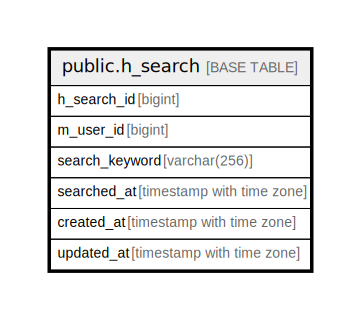

# public.h_search

## Description

## Columns

| Name | Type | Default | Nullable | Children | Parents | Comment |
| ---- | ---- | ------- | -------- | -------- | ------- | ------- |
| h_search_id | bigint |  | false |  |  |  |
| m_user_id | bigint |  | false |  |  |  |
| search_keyword | varchar(256) |  | false |  |  |  |
| searched_at | timestamp with time zone | CURRENT_TIMESTAMP | false |  |  |  |
| created_at | timestamp with time zone | CURRENT_TIMESTAMP | false |  |  |  |
| updated_at | timestamp with time zone | CURRENT_TIMESTAMP | false |  |  |  |

## Constraints

| Name | Type | Definition |
| ---- | ---- | ---------- |
| h_search_created_at_not_null | n | NOT NULL created_at |
| h_search_h_search_id_not_null | n | NOT NULL h_search_id |
| h_search_m_user_id_not_null | n | NOT NULL m_user_id |
| h_search_search_keyword_not_null | n | NOT NULL search_keyword |
| h_search_searched_at_not_null | n | NOT NULL searched_at |
| h_search_updated_at_not_null | n | NOT NULL updated_at |
| h_search_pkey | PRIMARY KEY | PRIMARY KEY (h_search_id) |

## Indexes

| Name | Definition |
| ---- | ---------- |
| h_search_pkey | CREATE UNIQUE INDEX h_search_pkey ON public.h_search USING btree (h_search_id) |
| idx_1_h_search | CREATE INDEX idx_1_h_search ON public.h_search USING btree (m_user_id) |

## Relations

---

> Generated by [tbls](https://github.com/k1LoW/tbls)
