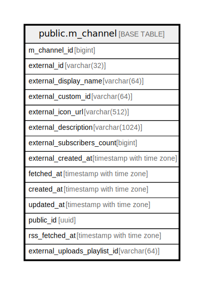

# public.m_channel

## Description

## Columns

| Name | Type | Default | Nullable | Children | Parents | Comment |
| ---- | ---- | ------- | -------- | -------- | ------- | ------- |
| m_channel_id | bigint |  | false |  |  |  |
| external_id | varchar(32) |  | false |  |  |  |
| external_display_name | varchar(64) |  | false |  |  |  |
| external_custom_id | varchar(64) |  | false |  |  |  |
| external_icon_url | varchar(512) |  | false |  |  |  |
| external_description | varchar(1024) |  | false |  |  |  |
| external_subscribers_count | bigint |  | false |  |  |  |
| external_created_at | timestamp with time zone |  | false |  |  |  |
| fetched_at | timestamp with time zone |  | false |  |  |  |
| created_at | timestamp with time zone | CURRENT_TIMESTAMP | false |  |  |  |
| updated_at | timestamp with time zone | CURRENT_TIMESTAMP | false |  |  |  |
| public_id | uuid |  | false |  |  |  |
| rss_fetched_at | timestamp with time zone |  | false |  |  |  |
| external_uploads_playlist_id | varchar(64) |  | false |  |  |  |
| bulk_fetched_at | timestamp with time zone |  | false |  |  |  |

## Constraints

| Name | Type | Definition |
| ---- | ---- | ---------- |
| m_channel_bulk_fetched_at_not_null | n | NOT NULL bulk_fetched_at |
| m_channel_created_at_not_null | n | NOT NULL created_at |
| m_channel_external_created_at_not_null | n | NOT NULL external_created_at |
| m_channel_external_custom_id_not_null | n | NOT NULL external_custom_id |
| m_channel_external_description_not_null | n | NOT NULL external_description |
| m_channel_external_display_name_not_null | n | NOT NULL external_display_name |
| m_channel_external_icon_url_not_null | n | NOT NULL external_icon_url |
| m_channel_external_id_not_null | n | NOT NULL external_id |
| m_channel_external_subscribers_count_not_null | n | NOT NULL external_subscribers_count |
| m_channel_external_uploads_playlist_id_not_null | n | NOT NULL external_uploads_playlist_id |
| m_channel_fetched_at_not_null | n | NOT NULL fetched_at |
| m_channel_m_channel_id_not_null | n | NOT NULL m_channel_id |
| m_channel_public_id_not_null | n | NOT NULL public_id |
| m_channel_rss_fetched_at_not_null | n | NOT NULL rss_fetched_at |
| m_channel_updated_at_not_null | n | NOT NULL updated_at |
| m_channel_pkey | PRIMARY KEY | PRIMARY KEY (m_channel_id) |

## Indexes

| Name | Definition |
| ---- | ---------- |
| m_channel_pkey | CREATE UNIQUE INDEX m_channel_pkey ON public.m_channel USING btree (m_channel_id) |
| uk_1_m_channel | CREATE UNIQUE INDEX uk_1_m_channel ON public.m_channel USING btree (public_id) |
| uk_2_m_channel | CREATE UNIQUE INDEX uk_2_m_channel ON public.m_channel USING btree (external_id) |
| uk_3_m_channel | CREATE UNIQUE INDEX uk_3_m_channel ON public.m_channel USING btree (external_custom_id) |
| idx_1_m_channel | CREATE INDEX idx_1_m_channel ON public.m_channel USING btree (rss_fetched_at) |
| idx_2_m_channel | CREATE INDEX idx_2_m_channel ON public.m_channel USING btree (bulk_fetched_at) |

## Relations

---

> Generated by [tbls](https://github.com/k1LoW/tbls)
