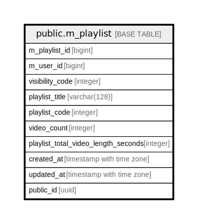

# public.m_playlist

## Description

## Columns

| Name | Type | Default | Nullable | Children | Parents | Comment |
| ---- | ---- | ------- | -------- | -------- | ------- | ------- |
| m_playlist_id | bigint |  | false |  |  |  |
| m_user_id | bigint |  | false |  |  |  |
| visibility_code | integer | 0 | false |  |  |  |
| playlist_title | varchar(128) |  | false |  |  |  |
| playlist_code | integer | 0 | false |  |  |  |
| video_count | integer | 0 | false |  |  |  |
| created_at | timestamp with time zone | CURRENT_TIMESTAMP | false |  |  |  |
| updated_at | timestamp with time zone | CURRENT_TIMESTAMP | false |  |  |  |
| public_id | uuid | uuidv7() | false |  |  |  |
| playlist_description | varchar(255) | ''::character varying | false |  |  |  |

## Constraints

| Name | Type | Definition |
| ---- | ---- | ---------- |
| m_playlist_created_at_not_null | n | NOT NULL created_at |
| m_playlist_m_playlist_id_not_null | n | NOT NULL m_playlist_id |
| m_playlist_m_user_id_not_null | n | NOT NULL m_user_id |
| m_playlist_playlist_code_not_null | n | NOT NULL playlist_code |
| m_playlist_playlist_description_not_null | n | NOT NULL playlist_description |
| m_playlist_playlist_title_not_null | n | NOT NULL playlist_title |
| m_playlist_public_id_not_null | n | NOT NULL public_id |
| m_playlist_updated_at_not_null | n | NOT NULL updated_at |
| m_playlist_video_count_not_null | n | NOT NULL video_count |
| m_playlist_visibility_code_not_null | n | NOT NULL visibility_code |
| m_playlist_pkey | PRIMARY KEY | PRIMARY KEY (m_playlist_id) |

## Indexes

| Name | Definition |
| ---- | ---------- |
| m_playlist_pkey | CREATE UNIQUE INDEX m_playlist_pkey ON public.m_playlist USING btree (m_playlist_id) |
| uk_1_m_playlist | CREATE UNIQUE INDEX uk_1_m_playlist ON public.m_playlist USING btree (public_id) |
| idx_1_m_playlist | CREATE INDEX idx_1_m_playlist ON public.m_playlist USING btree (m_user_id, visibility_code, playlist_code, created_at) |

## Relations

---

> Generated by [tbls](https://github.com/k1LoW/tbls)
