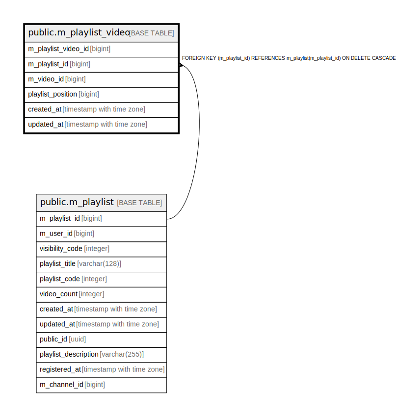

# public.m_playlist_video

## Description

## Columns

| Name | Type | Default | Nullable | Children | Parents | Comment |
| ---- | ---- | ------- | -------- | -------- | ------- | ------- |
| m_playlist_video_id | bigint |  | false |  |  |  |
| m_playlist_id | bigint |  | false |  | [public.m_playlist](public.m_playlist.md) |  |
| m_video_id | bigint |  | false |  |  |  |
| playlist_position | bigint |  | false |  |  |  |
| created_at | timestamp with time zone | CURRENT_TIMESTAMP | false |  |  |  |
| updated_at | timestamp with time zone | CURRENT_TIMESTAMP | false |  |  |  |

## Constraints

| Name | Type | Definition |
| ---- | ---- | ---------- |
| m_playlist_video_created_at_not_null | n | NOT NULL created_at |
| m_playlist_video_m_playlist_id_not_null | n | NOT NULL m_playlist_id |
| m_playlist_video_m_playlist_video_id_not_null | n | NOT NULL m_playlist_video_id |
| m_playlist_video_m_video_id_not_null | n | NOT NULL m_video_id |
| m_playlist_video_playlist_position_not_null | n | NOT NULL playlist_position |
| m_playlist_video_updated_at_not_null | n | NOT NULL updated_at |
| fk_1_m_playlist_video | FOREIGN KEY | FOREIGN KEY (m_playlist_id) REFERENCES m_playlist(m_playlist_id) ON DELETE CASCADE |
| m_playlist_video_pkey | PRIMARY KEY | PRIMARY KEY (m_playlist_video_id) |

## Indexes

| Name | Definition |
| ---- | ---------- |
| m_playlist_video_pkey | CREATE UNIQUE INDEX m_playlist_video_pkey ON public.m_playlist_video USING btree (m_playlist_video_id) |
| idx_1_m_playlist_video | CREATE INDEX idx_1_m_playlist_video ON public.m_playlist_video USING btree (m_playlist_id, playlist_position) |
| uk_1_m_playlist_video | CREATE UNIQUE INDEX uk_1_m_playlist_video ON public.m_playlist_video USING btree (m_playlist_id, m_video_id, playlist_position) |

## Relations

---

> Generated by [tbls](https://github.com/k1LoW/tbls)
