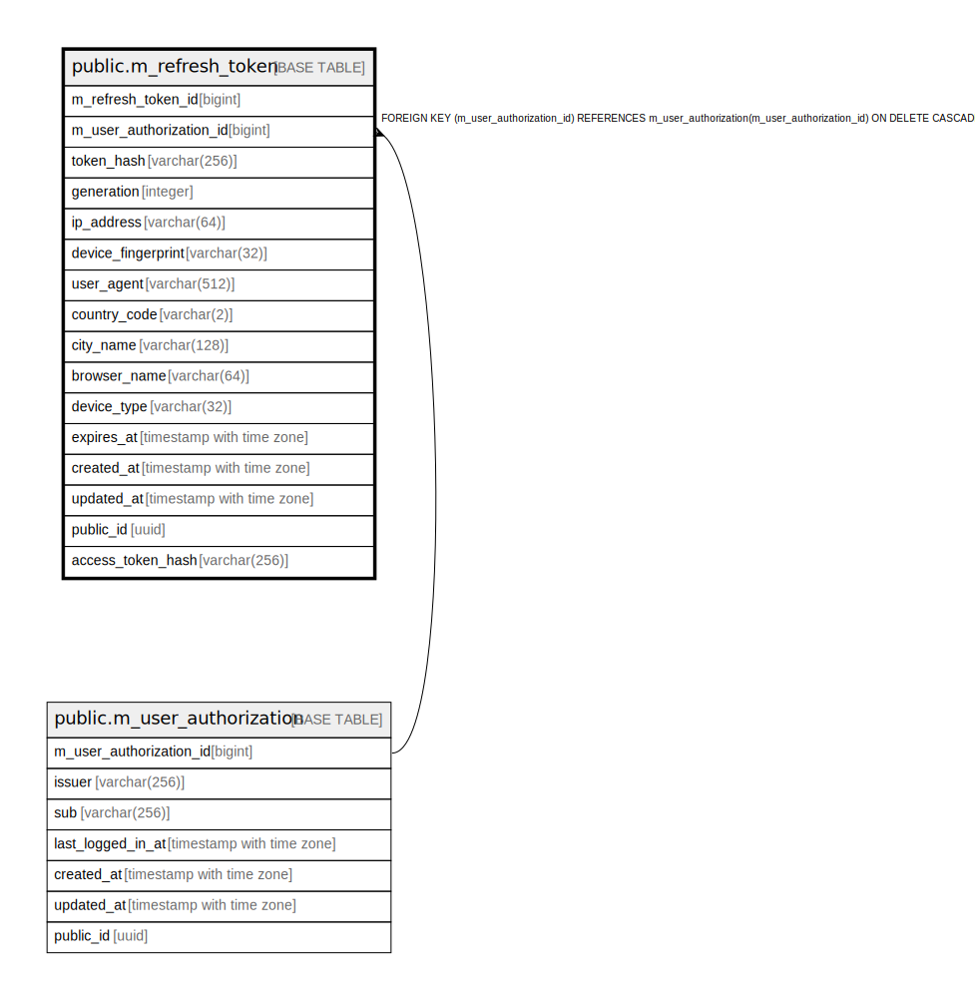

# public.m_refresh_token

## Description

## Columns

| Name | Type | Default | Nullable | Children | Parents | Comment |
| ---- | ---- | ------- | -------- | -------- | ------- | ------- |
| m_refresh_token_id | bigint |  | false |  |  |  |
| m_user_authorization_id | bigint |  | false |  | [public.m_user_authorization](public.m_user_authorization.md) |  |
| token_hash | varchar(256) |  | false |  |  |  |
| generation | integer | 1 | false |  |  |  |
| ip_address | varchar(64) |  | false |  |  |  |
| device_fingerprint | varchar(32) |  | false |  |  |  |
| user_agent | varchar(512) |  | false |  |  |  |
| country_code | varchar(2) |  | false |  |  |  |
| city_name | varchar(128) |  | false |  |  |  |
| browser_name | varchar(64) |  | false |  |  |  |
| device_type | varchar(32) |  | false |  |  |  |
| expires_at | timestamp with time zone |  | false |  |  |  |
| created_at | timestamp with time zone | CURRENT_TIMESTAMP | false |  |  |  |
| updated_at | timestamp with time zone | CURRENT_TIMESTAMP | false |  |  |  |
| public_id | uuid | uuidv7() | false |  |  |  |
| access_token_jti | uuid |  | false |  |  |  |

## Constraints

| Name | Type | Definition |
| ---- | ---- | ---------- |
| m_refresh_token_access_token_jti_not_null | n | NOT NULL access_token_jti |
| m_refresh_token_browser_name_not_null | n | NOT NULL browser_name |
| m_refresh_token_city_name_not_null | n | NOT NULL city_name |
| m_refresh_token_country_code_not_null | n | NOT NULL country_code |
| m_refresh_token_created_at_not_null | n | NOT NULL created_at |
| m_refresh_token_device_fingerprint_not_null | n | NOT NULL device_fingerprint |
| m_refresh_token_device_type_not_null | n | NOT NULL device_type |
| m_refresh_token_expires_at_not_null | n | NOT NULL expires_at |
| m_refresh_token_generation_not_null | n | NOT NULL generation |
| m_refresh_token_ip_address_not_null | n | NOT NULL ip_address |
| m_refresh_token_m_refresh_token_id_not_null | n | NOT NULL m_refresh_token_id |
| m_refresh_token_m_user_authorization_id_not_null | n | NOT NULL m_user_authorization_id |
| m_refresh_token_public_id_not_null | n | NOT NULL public_id |
| m_refresh_token_token_hash_not_null | n | NOT NULL token_hash |
| m_refresh_token_updated_at_not_null | n | NOT NULL updated_at |
| m_refresh_token_user_agent_not_null | n | NOT NULL user_agent |
| m_refresh_token_m_user_authorization_id_fkey | FOREIGN KEY | FOREIGN KEY (m_user_authorization_id) REFERENCES m_user_authorization(m_user_authorization_id) ON DELETE CASCADE |
| m_refresh_token_pkey | PRIMARY KEY | PRIMARY KEY (m_refresh_token_id) |

## Indexes

| Name | Definition |
| ---- | ---------- |
| m_refresh_token_pkey | CREATE UNIQUE INDEX m_refresh_token_pkey ON public.m_refresh_token USING btree (m_refresh_token_id) |
| uk_1_m_refresh_token | CREATE UNIQUE INDEX uk_1_m_refresh_token ON public.m_refresh_token USING btree (token_hash) |
| idx_1_m_refresh_token | CREATE INDEX idx_1_m_refresh_token ON public.m_refresh_token USING btree (expires_at) |
| uk_2_m_refresh_token | CREATE UNIQUE INDEX uk_2_m_refresh_token ON public.m_refresh_token USING btree (public_id) |
| idx_2_m_refresh_token | CREATE INDEX idx_2_m_refresh_token ON public.m_refresh_token USING btree (m_user_authorization_id, updated_at) |

## Relations

---

> Generated by [tbls](https://github.com/k1LoW/tbls)
