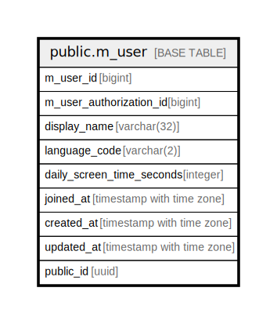

# public.m_user

## Description

## Columns

| Name | Type | Default | Nullable | Children | Parents | Comment |
| ---- | ---- | ------- | -------- | -------- | ------- | ------- |
| m_user_id | bigint |  | false |  |  |  |
| m_user_authorization_id | bigint |  | false |  |  |  |
| display_name | varchar(32) |  | false |  |  |  |
| language_code | varchar(2) |  | false |  |  |  |
| daily_screen_time_seconds | integer | 86401 | false |  |  |  |
| joined_at | timestamp with time zone | CURRENT_TIMESTAMP | false |  |  |  |
| created_at | timestamp with time zone | CURRENT_TIMESTAMP | false |  |  |  |
| updated_at | timestamp with time zone | CURRENT_TIMESTAMP | false |  |  |  |
| public_id | uuid | uuidv7() | false |  |  |  |

## Constraints

| Name | Type | Definition |
| ---- | ---- | ---------- |
| m_user_created_at_not_null | n | NOT NULL created_at |
| m_user_daily_screen_time_seconds_not_null | n | NOT NULL daily_screen_time_seconds |
| m_user_display_name_not_null | n | NOT NULL display_name |
| m_user_joined_at_not_null | n | NOT NULL joined_at |
| m_user_language_code_not_null | n | NOT NULL language_code |
| m_user_m_user_authorization_id_not_null | n | NOT NULL m_user_authorization_id |
| m_user_m_user_id_not_null | n | NOT NULL m_user_id |
| m_user_public_id_not_null | n | NOT NULL public_id |
| m_user_updated_at_not_null | n | NOT NULL updated_at |
| m_user_pkey | PRIMARY KEY | PRIMARY KEY (m_user_id) |

## Indexes

| Name | Definition |
| ---- | ---------- |
| m_user_pkey | CREATE UNIQUE INDEX m_user_pkey ON public.m_user USING btree (m_user_id) |
| uk_1_m_user | CREATE UNIQUE INDEX uk_1_m_user ON public.m_user USING btree (public_id) |

## Relations

---

> Generated by [tbls](https://github.com/k1LoW/tbls)
