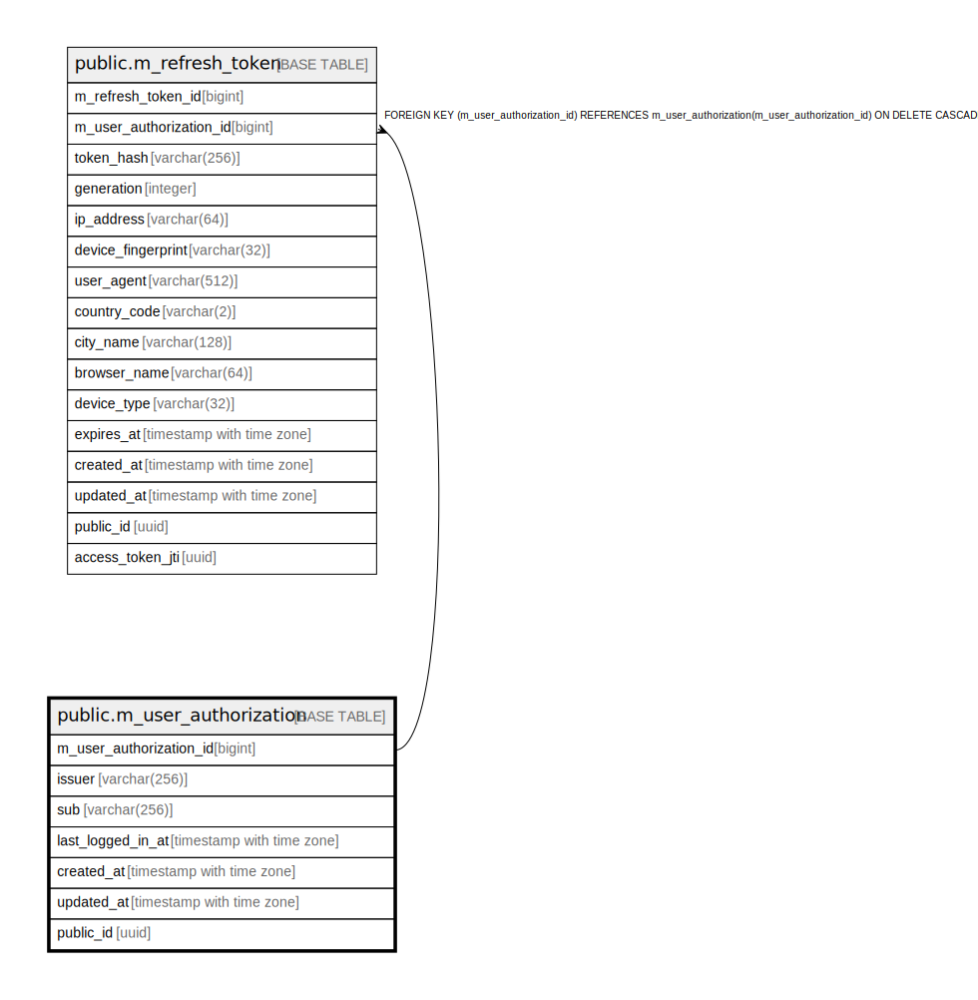

# public.m_user_authorization

## Description

## Columns

| Name | Type | Default | Nullable | Children | Parents | Comment |
| ---- | ---- | ------- | -------- | -------- | ------- | ------- |
| m_user_authorization_id | bigint |  | false | [public.m_refresh_token](public.m_refresh_token.md) |  |  |
| issuer | varchar(256) |  | false |  |  |  |
| sub | varchar(256) |  | false |  |  |  |
| last_logged_in_at | timestamp with time zone |  | false |  |  |  |
| created_at | timestamp with time zone | CURRENT_TIMESTAMP | false |  |  |  |
| updated_at | timestamp with time zone | CURRENT_TIMESTAMP | false |  |  |  |
| public_id | uuid |  | false |  |  |  |

## Constraints

| Name | Type | Definition |
| ---- | ---- | ---------- |
| m_user_authorization_created_at_not_null | n | NOT NULL created_at |
| m_user_authorization_issuer_not_null | n | NOT NULL issuer |
| m_user_authorization_last_logged_in_at_not_null | n | NOT NULL last_logged_in_at |
| m_user_authorization_m_user_authorization_id_not_null | n | NOT NULL m_user_authorization_id |
| m_user_authorization_public_id_not_null | n | NOT NULL public_id |
| m_user_authorization_sub_not_null | n | NOT NULL sub |
| m_user_authorization_updated_at_not_null | n | NOT NULL updated_at |
| m_user_authorization_pkey | PRIMARY KEY | PRIMARY KEY (m_user_authorization_id) |

## Indexes

| Name | Definition |
| ---- | ---------- |
| m_user_authorization_pkey | CREATE UNIQUE INDEX m_user_authorization_pkey ON public.m_user_authorization USING btree (m_user_authorization_id) |
| uk_1_m_user_authorization | CREATE UNIQUE INDEX uk_1_m_user_authorization ON public.m_user_authorization USING btree (issuer, sub) |
| uk_2_m_user_authorization | CREATE UNIQUE INDEX uk_2_m_user_authorization ON public.m_user_authorization USING btree (public_id) |

## Relations

---

> Generated by [tbls](https://github.com/k1LoW/tbls)
