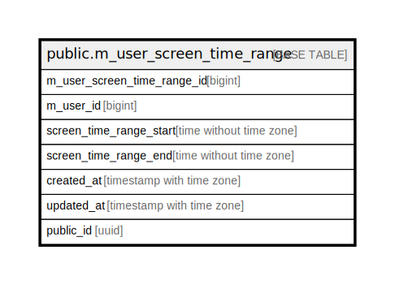

# public.m_user_screen_time_range

## Description

## Columns

| Name | Type | Default | Nullable | Children | Parents | Comment |
| ---- | ---- | ------- | -------- | -------- | ------- | ------- |
| m_user_screen_time_range_id | bigint |  | false |  |  |  |
| m_user_id | bigint |  | false |  |  |  |
| screen_time_range_start | time without time zone |  | false |  |  |  |
| screen_time_range_end | time without time zone |  | false |  |  |  |
| created_at | timestamp with time zone | CURRENT_TIMESTAMP | false |  |  |  |
| updated_at | timestamp with time zone | CURRENT_TIMESTAMP | false |  |  |  |
| public_id | uuid |  | false |  |  |  |

## Constraints

| Name | Type | Definition |
| ---- | ---- | ---------- |
| m_user_screen_time_range_created_at_not_null | n | NOT NULL created_at |
| m_user_screen_time_range_m_user_id_not_null | n | NOT NULL m_user_id |
| m_user_screen_time_range_m_user_screen_time_range_id_not_null | n | NOT NULL m_user_screen_time_range_id |
| m_user_screen_time_range_public_id_not_null | n | NOT NULL public_id |
| m_user_screen_time_range_screen_time_range_end_not_null | n | NOT NULL screen_time_range_end |
| m_user_screen_time_range_screen_time_range_start_not_null | n | NOT NULL screen_time_range_start |
| m_user_screen_time_range_updated_at_not_null | n | NOT NULL updated_at |
| m_user_screen_time_range_pkey | PRIMARY KEY | PRIMARY KEY (m_user_screen_time_range_id) |

## Indexes

| Name | Definition |
| ---- | ---------- |
| m_user_screen_time_range_pkey | CREATE UNIQUE INDEX m_user_screen_time_range_pkey ON public.m_user_screen_time_range USING btree (m_user_screen_time_range_id) |
| uk_1_m_user_screen_time_range | CREATE UNIQUE INDEX uk_1_m_user_screen_time_range ON public.m_user_screen_time_range USING btree (public_id) |
| idx_1_m_user_screen_time_range | CREATE INDEX idx_1_m_user_screen_time_range ON public.m_user_screen_time_range USING btree (m_user_id) |

## Relations

---

> Generated by [tbls](https://github.com/k1LoW/tbls)
