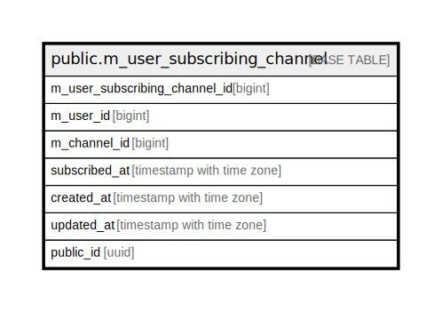

# public.m_user_subscribing_channel

## Description

## Columns

| Name | Type | Default | Nullable | Children | Parents | Comment |
| ---- | ---- | ------- | -------- | -------- | ------- | ------- |
| m_user_subscribing_channel_id | bigint |  | false |  |  |  |
| m_user_id | bigint |  | false |  |  |  |
| m_channel_id | bigint |  | false |  |  |  |
| subscribed_at | timestamp with time zone | CURRENT_TIMESTAMP | false |  |  |  |
| created_at | timestamp with time zone | CURRENT_TIMESTAMP | false |  |  |  |
| updated_at | timestamp with time zone | CURRENT_TIMESTAMP | false |  |  |  |
| public_id | uuid | uuidv7() | false |  |  |  |

## Constraints

| Name | Type | Definition |
| ---- | ---- | ---------- |
| m_user_subscribing_channel_created_at_not_null | n | NOT NULL created_at |
| m_user_subscribing_channel_m_channel_id_not_null | n | NOT NULL m_channel_id |
| m_user_subscribing_channel_m_user_id_not_null | n | NOT NULL m_user_id |
| m_user_subscribing_channel_m_user_subscribing_channel__not_null | n | NOT NULL m_user_subscribing_channel_id |
| m_user_subscribing_channel_public_id_not_null | n | NOT NULL public_id |
| m_user_subscribing_channel_subscribed_at_not_null | n | NOT NULL subscribed_at |
| m_user_subscribing_channel_updated_at_not_null | n | NOT NULL updated_at |
| m_user_subscribing_channel_pkey | PRIMARY KEY | PRIMARY KEY (m_user_subscribing_channel_id) |

## Indexes

| Name | Definition |
| ---- | ---------- |
| m_user_subscribing_channel_pkey | CREATE UNIQUE INDEX m_user_subscribing_channel_pkey ON public.m_user_subscribing_channel USING btree (m_user_subscribing_channel_id) |
| uk_1_m_user_subscribing_channel | CREATE UNIQUE INDEX uk_1_m_user_subscribing_channel ON public.m_user_subscribing_channel USING btree (m_user_id, m_channel_id) |
| uk_2_m_user_subscribing_channel | CREATE UNIQUE INDEX uk_2_m_user_subscribing_channel ON public.m_user_subscribing_channel USING btree (public_id) |
| idx_1_m_user_subscribing_channel | CREATE INDEX idx_1_m_user_subscribing_channel ON public.m_user_subscribing_channel USING btree (m_user_id) |
| idx_2_m_user_subscribing_channel | CREATE INDEX idx_2_m_user_subscribing_channel ON public.m_user_subscribing_channel USING btree (m_user_id, public_id) |
| idx_3_m_user_subscribing_channel | CREATE INDEX idx_3_m_user_subscribing_channel ON public.m_user_subscribing_channel USING btree (m_channel_id) |

## Relations

---

> Generated by [tbls](https://github.com/k1LoW/tbls)
