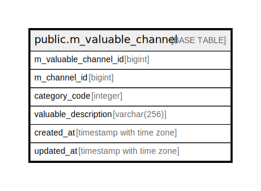

# public.m_valuable_channel

## Description

## Columns

| Name | Type | Default | Nullable | Children | Parents | Comment |
| ---- | ---- | ------- | -------- | -------- | ------- | ------- |
| m_valuable_channel_id | bigint |  | false |  |  |  |
| m_channel_id | bigint |  | false |  |  |  |
| category_code | integer |  | false |  |  |  |
| valuable_description | varchar(256) |  | false |  |  |  |
| created_at | timestamp with time zone | CURRENT_TIMESTAMP | false |  |  |  |
| updated_at | timestamp with time zone | CURRENT_TIMESTAMP | false |  |  |  |

## Constraints

| Name | Type | Definition |
| ---- | ---- | ---------- |
| m_valuable_channel_category_code_not_null | n | NOT NULL category_code |
| m_valuable_channel_created_at_not_null | n | NOT NULL created_at |
| m_valuable_channel_m_channel_id_not_null | n | NOT NULL m_channel_id |
| m_valuable_channel_m_valuable_channel_id_not_null | n | NOT NULL m_valuable_channel_id |
| m_valuable_channel_updated_at_not_null | n | NOT NULL updated_at |
| m_valuable_channel_valuable_description_not_null | n | NOT NULL valuable_description |
| m_valuable_channel_pkey | PRIMARY KEY | PRIMARY KEY (m_valuable_channel_id) |

## Indexes

| Name | Definition |
| ---- | ---------- |
| m_valuable_channel_pkey | CREATE UNIQUE INDEX m_valuable_channel_pkey ON public.m_valuable_channel USING btree (m_valuable_channel_id) |
| uk_1_m_valuable_channel | CREATE UNIQUE INDEX uk_1_m_valuable_channel ON public.m_valuable_channel USING btree (m_channel_id) |

## Relations

---

> Generated by [tbls](https://github.com/k1LoW/tbls)
