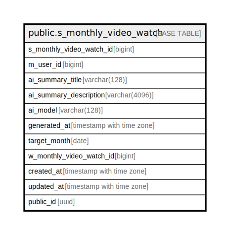

# public.s_monthly_video_watch

## Description

## Columns

| Name | Type | Default | Nullable | Children | Parents | Comment |
| ---- | ---- | ------- | -------- | -------- | ------- | ------- |
| s_monthly_video_watch_id | bigint |  | false |  |  |  |
| m_user_id | bigint |  | false |  |  |  |
| ai_summary_title | varchar(128) |  | false |  |  |  |
| ai_summary_description | varchar(4096) |  | false |  |  |  |
| ai_model | varchar(128) |  | false |  |  |  |
| generated_at | timestamp with time zone |  | false |  |  |  |
| target_month | date |  | false |  |  |  |
| created_at | timestamp with time zone | CURRENT_TIMESTAMP | false |  |  |  |
| updated_at | timestamp with time zone | CURRENT_TIMESTAMP | false |  |  |  |
| public_id | uuid |  | false |  |  |  |

## Constraints

| Name | Type | Definition |
| ---- | ---- | ---------- |
| s_monthly_video_watch_ai_model_not_null | n | NOT NULL ai_model |
| s_monthly_video_watch_ai_summary_description_not_null | n | NOT NULL ai_summary_description |
| s_monthly_video_watch_ai_summary_title_not_null | n | NOT NULL ai_summary_title |
| s_monthly_video_watch_created_at_not_null | n | NOT NULL created_at |
| s_monthly_video_watch_generated_at_not_null | n | NOT NULL generated_at |
| s_monthly_video_watch_m_user_id_not_null | n | NOT NULL m_user_id |
| s_monthly_video_watch_public_id_not_null | n | NOT NULL public_id |
| s_monthly_video_watch_s_monthly_video_watch_id_not_null | n | NOT NULL s_monthly_video_watch_id |
| s_monthly_video_watch_target_month_not_null | n | NOT NULL target_month |
| s_monthly_video_watch_updated_at_not_null | n | NOT NULL updated_at |
| s_monthly_video_watch_pkey | PRIMARY KEY | PRIMARY KEY (s_monthly_video_watch_id) |

## Indexes

| Name | Definition |
| ---- | ---------- |
| s_monthly_video_watch_pkey | CREATE UNIQUE INDEX s_monthly_video_watch_pkey ON public.s_monthly_video_watch USING btree (s_monthly_video_watch_id) |
| uk_1_s_monthly_video_watch | CREATE UNIQUE INDEX uk_1_s_monthly_video_watch ON public.s_monthly_video_watch USING btree (public_id) |
| uk_2_s_monthly_video_watch | CREATE UNIQUE INDEX uk_2_s_monthly_video_watch ON public.s_monthly_video_watch USING btree (m_user_id, target_month) |

## Relations

---

> Generated by [tbls](https://github.com/k1LoW/tbls)
