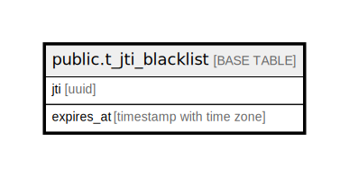

# public.t_jti_blacklist

## Description

## Columns

| Name | Type | Default | Nullable | Children | Parents | Comment |
| ---- | ---- | ------- | -------- | -------- | ------- | ------- |
| jti | uuid |  | false |  |  |  |
| expires_at | timestamp with time zone |  | false |  |  |  |

## Constraints

| Name | Type | Definition |
| ---- | ---- | ---------- |
| t_jti_blacklist_expires_at_not_null | n | NOT NULL expires_at |
| t_jti_blacklist_jti_not_null | n | NOT NULL jti |
| t_jti_blacklist_pkey | PRIMARY KEY | PRIMARY KEY (jti) |

## Indexes

| Name | Definition |
| ---- | ---------- |
| t_jti_blacklist_pkey | CREATE UNIQUE INDEX t_jti_blacklist_pkey ON public.t_jti_blacklist USING btree (jti) |
| idx_1_t_jti_blacklist | CREATE INDEX idx_1_t_jti_blacklist ON public.t_jti_blacklist USING btree (expires_at) |

## Relations

---

> Generated by [tbls](https://github.com/k1LoW/tbls)
