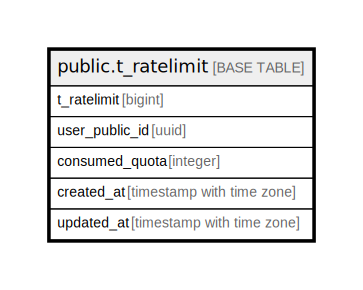

# public.t_ratelimit

## Description

## Columns

| Name | Type | Default | Nullable | Children | Parents | Comment |
| ---- | ---- | ------- | -------- | -------- | ------- | ------- |
| t_ratelimit_id | bigint |  | false |  |  |  |
| user_public_id | uuid |  | false |  |  |  |
| consumed_quota | integer | 0 | false |  |  |  |
| created_at | timestamp with time zone | CURRENT_TIMESTAMP | false |  |  |  |
| updated_at | timestamp with time zone | CURRENT_TIMESTAMP | false |  |  |  |

## Constraints

| Name | Type | Definition |
| ---- | ---- | ---------- |
| t_ratelimit_consumed_quota_not_null | n | NOT NULL consumed_quota |
| t_ratelimit_created_at_not_null | n | NOT NULL created_at |
| t_ratelimit_t_ratelimit_id_not_null | n | NOT NULL t_ratelimit_id |
| t_ratelimit_updated_at_not_null | n | NOT NULL updated_at |
| t_ratelimit_user_public_id_not_null | n | NOT NULL user_public_id |
| t_ratelimit_pkey | PRIMARY KEY | PRIMARY KEY (t_ratelimit_id) |

## Indexes

| Name | Definition |
| ---- | ---------- |
| t_ratelimit_pkey | CREATE UNIQUE INDEX t_ratelimit_pkey ON public.t_ratelimit USING btree (t_ratelimit_id) |
| idx_1_t_ratelimit | CREATE UNIQUE INDEX idx_1_t_ratelimit ON public.t_ratelimit USING btree (user_public_id) |

## Relations

---

> Generated by [tbls](https://github.com/k1LoW/tbls)
