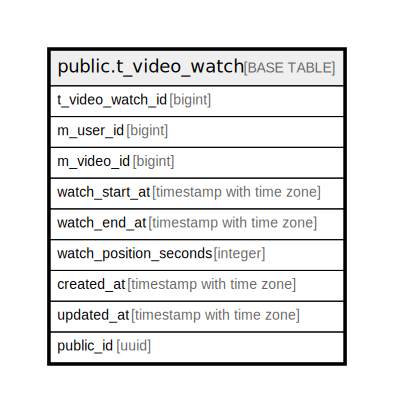

# public.t_video_watch

## Description

## Columns

| Name | Type | Default | Nullable | Children | Parents | Comment |
| ---- | ---- | ------- | -------- | -------- | ------- | ------- |
| t_video_watch_id | bigint |  | false |  |  |  |
| m_user_id | bigint |  | false |  |  |  |
| m_video_id | bigint |  | false |  |  |  |
| watch_start_at | timestamp with time zone | CURRENT_TIMESTAMP | false |  |  |  |
| watch_end_at | timestamp with time zone | '9999-12-31 23:59:59+00'::timestamp with time zone | false |  |  |  |
| watch_position_seconds | integer | 0 | false |  |  |  |
| created_at | timestamp with time zone | CURRENT_TIMESTAMP | false |  |  |  |
| updated_at | timestamp with time zone | CURRENT_TIMESTAMP | false |  |  |  |
| public_id | uuid | uuidv7() | false |  |  |  |

## Constraints

| Name | Type | Definition |
| ---- | ---- | ---------- |
| t_video_watch_created_at_not_null | n | NOT NULL created_at |
| t_video_watch_m_user_id_not_null | n | NOT NULL m_user_id |
| t_video_watch_m_video_id_not_null | n | NOT NULL m_video_id |
| t_video_watch_public_id_not_null | n | NOT NULL public_id |
| t_video_watch_t_video_watch_id_not_null | n | NOT NULL t_video_watch_id |
| t_video_watch_updated_at_not_null | n | NOT NULL updated_at |
| t_video_watch_watch_end_at_not_null | n | NOT NULL watch_end_at |
| t_video_watch_watch_position_seconds_not_null | n | NOT NULL watch_position_seconds |
| t_video_watch_watch_start_at_not_null | n | NOT NULL watch_start_at |
| t_video_watch_pkey | PRIMARY KEY | PRIMARY KEY (t_video_watch_id) |
| excl_1_t_video_watch | x | EXCLUDE USING gist (m_user_id WITH =, m_video_id WITH =, tstzrange(watch_start_at, watch_end_at) WITH &&) |

## Indexes

| Name | Definition |
| ---- | ---------- |
| t_video_watch_pkey | CREATE UNIQUE INDEX t_video_watch_pkey ON public.t_video_watch USING btree (t_video_watch_id) |
| excl_1_t_video_watch | CREATE INDEX excl_1_t_video_watch ON public.t_video_watch USING gist (m_user_id, m_video_id, tstzrange(watch_start_at, watch_end_at)) |
| uk_1_t_video_watch | CREATE UNIQUE INDEX uk_1_t_video_watch ON public.t_video_watch USING btree (public_id) |
| idx_1_t_video_watch | CREATE INDEX idx_1_t_video_watch ON public.t_video_watch USING btree (m_user_id) |

## Relations

---

> Generated by [tbls](https://github.com/k1LoW/tbls)
