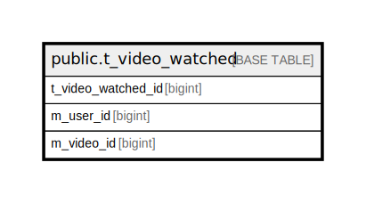

# public.t_video_watched

## Description

## Columns

| Name | Type | Default | Nullable | Children | Parents | Comment |
| ---- | ---- | ------- | -------- | -------- | ------- | ------- |
| t_video_watched_id | bigint |  | false |  |  |  |
| m_user_id | bigint |  | false |  |  |  |
| m_video_id | bigint |  | false |  |  |  |

## Constraints

| Name | Type | Definition |
| ---- | ---- | ---------- |
| t_video_watched_m_user_id_not_null | n | NOT NULL m_user_id |
| t_video_watched_m_video_id_not_null | n | NOT NULL m_video_id |
| t_video_watched_t_video_watched_id_not_null | n | NOT NULL t_video_watched_id |
| t_video_watched_pkey | PRIMARY KEY | PRIMARY KEY (t_video_watched_id) |

## Indexes

| Name | Definition |
| ---- | ---------- |
| t_video_watched_pkey | CREATE UNIQUE INDEX t_video_watched_pkey ON public.t_video_watched USING btree (t_video_watched_id) |
| uk_1_t_video_watched | CREATE UNIQUE INDEX uk_1_t_video_watched ON public.t_video_watched USING btree (m_user_id, m_video_id) |

## Relations

---

> Generated by [tbls](https://github.com/k1LoW/tbls)
