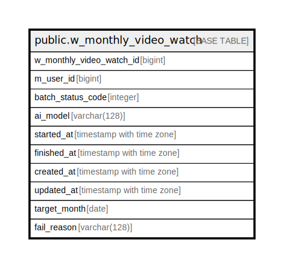

# public.w_monthly_video_watch

## Description

## Columns

| Name | Type | Default | Nullable | Children | Parents | Comment |
| ---- | ---- | ------- | -------- | -------- | ------- | ------- |
| w_monthly_video_watch_id | bigint |  | false |  |  |  |
| m_user_id | bigint |  | false |  |  |  |
| batch_status_code | integer |  | false |  |  |  |
| ai_model | varchar(128) |  | false |  |  |  |
| started_at | timestamp with time zone |  | false |  |  |  |
| finished_at | timestamp with time zone |  | false |  |  |  |
| created_at | timestamp with time zone | CURRENT_TIMESTAMP | false |  |  |  |
| updated_at | timestamp with time zone | CURRENT_TIMESTAMP | false |  |  |  |
| target_month | date |  | false |  |  |  |
| fail_reason | varchar(128) |  | false |  |  |  |

## Constraints

| Name | Type | Definition |
| ---- | ---- | ---------- |
| w_monthly_video_watch_ai_model_not_null | n | NOT NULL ai_model |
| w_monthly_video_watch_batch_status_code_not_null | n | NOT NULL batch_status_code |
| w_monthly_video_watch_created_at_not_null | n | NOT NULL created_at |
| w_monthly_video_watch_fail_reason_not_null | n | NOT NULL fail_reason |
| w_monthly_video_watch_finished_at_not_null | n | NOT NULL finished_at |
| w_monthly_video_watch_m_user_id_not_null | n | NOT NULL m_user_id |
| w_monthly_video_watch_started_at_not_null | n | NOT NULL started_at |
| w_monthly_video_watch_target_month_not_null | n | NOT NULL target_month |
| w_monthly_video_watch_updated_at_not_null | n | NOT NULL updated_at |
| w_monthly_video_watch_w_monthly_video_watch_id_not_null | n | NOT NULL w_monthly_video_watch_id |
| w_monthly_video_watch_pkey | PRIMARY KEY | PRIMARY KEY (w_monthly_video_watch_id) |

## Indexes

| Name | Definition |
| ---- | ---------- |
| w_monthly_video_watch_pkey | CREATE UNIQUE INDEX w_monthly_video_watch_pkey ON public.w_monthly_video_watch USING btree (w_monthly_video_watch_id) |

## Relations

---

> Generated by [tbls](https://github.com/k1LoW/tbls)
